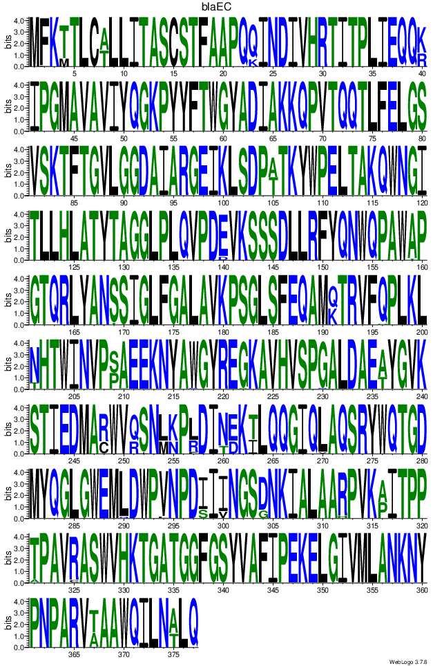

# Sequence Logo

Need to install python packages

`pip3 install weblogo Biopython argparse`

To run script:

`python3 script/create_blaEC_logo.py --email username@gmail.com`

# Docker

Create docker image

`docker build -t seq_logo -f DockerFile .`

Run Docker container

`docker run --rm -it -v $(pwd)/example_data:/workspace/example_data seq_logo:latest username@gmail.com`

# Sequence Logo Output

